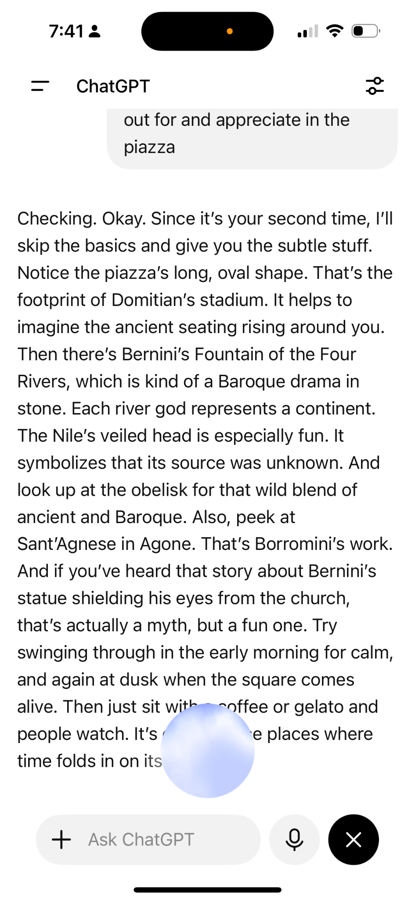
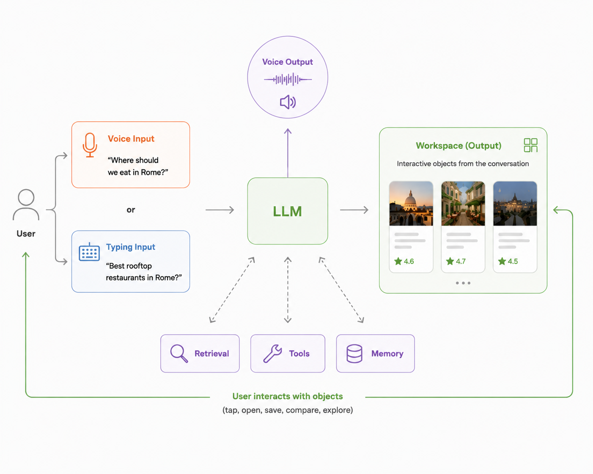

<!-- TODO: replace this placeholder with the teaser video embed.
     YouTube (unlisted): <iframe width="100%" height="400" src="https://www.youtube.com/embed/VIDEO_ID" title="Teaser demo (Rome)" frameborder="0" allowfullscreen></iframe>
     Or self-hosted: <video controls src="./teaser-demo.mp4"></video> -->
> 🎥 **Teaser demo (Rome)** — _video coming soon._

My husband and I were lying on the sofa one Friday evening, planning a trip back to Rome nearly ten years after our last visit. We were both excited, but after a long week neither of us wanted to open a laptop. Even typing on a phone felt like work, so we opened ChatGPT's live voice mode instead.

For the first few minutes, it felt almost magical. We asked about neighborhoods, restaurants, and places worth visiting, and it answered naturally. Then we asked for restaurant recommendations.

It started listing them. One after another. By the time it reached the fifth or sixth place, we'd already forgotten the first few names. We wanted to know what one restaurant actually looked like. Was it lively or quiet? What did people order there? Was the terrace worth sitting on? Instead, the conversation kept moving forward. Every follow-up produced more words, but never gave us anything we could point at.

Halfway through, it struck us that if this had been a real friend sitting across the table, they probably wouldn't have kept talking. They would have pulled out their phone, opened Google Maps or Instagram, and shown us a few photos. The conversation wouldn't have stayed entirely in words.

That evening raised a simple question: if large language models are already good enough to hold a conversation, why are we still treating every answer as something to read or listen to?

We spent the next several weeks building our own answer to that question.

## From conversation to workspace

The first thing we wanted to fix was the lack of visual context. If the assistant was talking about a museum, a restaurant, or a hotel, we wanted to see it. A single photo can tell you more about the atmosphere than three sentences ever could.

Simply showing images didn't work. After a few recommendations, the screen became a wall of photos. We couldn't tell which image belonged to which place, or whether the assistant was still talking about something we'd already scrolled past. We realized visual information needed structure too.

We eventually settled on cards: one object, one photo, one title, and a handful of structured facts. The cards appeared in the same order as the assistant introduced them, so the screen mirrored the conversation instead of competing with it. The cards gave the workspace structure, but not much depth. A photo and a short summary helped us recognize each place and decide whether it deserved a closer look, but they weren't enough to answer the next questions. So we made the objects explorable. Opening a card revealed photos, reviews, maps, history, and practical details without losing the rest of the recommendations.

We began thinking of this as an interactive workspace. The conversation introduced the objects, but once they appeared, we could interact with them directly. We also made one unusual decision: only the cards from the current turn stayed in the workspace. We weren't trying to build a transcript. We wanted the workspace to represent what the conversation was about right now.

We soon realized people explored those details very differently. Some looked at photos first, others at reviews or practical information. That made personalization surprisingly simple: instead of generating different answers, we could organize the same information differently.

The biggest surprise came from interaction. Once recommendations became cards, we stopped referring to them in voice or text. We tapped them instead. Opening a card replaced "tell me more about the second one." Saving a place or exploring a detail replaced "I like this one because…". Those interactions expressed intent more precisely than another sentence ever could.

They also became memories. Rather than inferring preferences from conversation alone, the assistant could remember the choices we'd already made and carry them into future sessions. Personalization wasn't another model layered on top of the assistant. It emerged naturally from the way people interacted with the information.

## Rome changed the prototype

We landed in Rome with a prototype that had mostly worked on our sofa. Real travel turned out to be different. We were standing outside the Colosseum, wandering through Trastevere, hopping on and off the metro, making decisions while moving instead of sitting still. The questions became smaller, more frequent, and constantly interrupted by the city around us. We weren't planning a trip anymore. We were living it.

One afternoon, we stopped in front of a small church surrounded by a crowd. We wanted to know why it was famous, but neither of us knew its name. We started describing it to the assistant and quickly realized how awkward that was. We were translating something the phone could already see into words before asking a question about it.

That moment convinced us to add camera input. Instead of describing a building, a menu, or a bottle of wine, we could simply point the camera at it.

Rome also exposed a trade-off in the workspace we had built. By focusing it on the current conversation, we'd made it much easier to decide what to do next. But we had also made it easier to lose what we'd already explored. More than once, we found ourselves asking the assistant to "show me the restaurants from before" just to get the cards back. We'd optimized the workspace for the present, but exploration also needs memory.

## Then the market moved

Looking back, we realized we hadn't been building travel software at all. The same problems appeared whenever the answer wasn't one thing, but a collection of comparable objects.

At the time, most assistants still treated those answers primarily as conversation. Rich content had become more common, but once an answer was generated, it mostly remained something you read, with each follow-up extending the transcript.

Then the market moved.

In the two months after we returned from Rome, ChatGPT, Perplexity, and Sesame all released major updates. They started showing richer visual content during conversations: maps, restaurant cards, images, links, citations, and structured search results. The direction felt immediately familiar. The industry was moving toward the same realization we had reached on our sofa: conversation alone isn't always the best representation of an answer.

<!-- TODO: replace with the three side-by-side demo videos (YouTube unlisted or self-hosted <video>). -->
> 🎥 **Side-by-side demos (Rome)** — _videos coming soon:_
> - ChatGPT Live (Rome)
> - Sesame (Rome)
> - Perplexity Live (Rome)

Watching them side by side, what stood out wasn't the differences—it was the convergence. Every assistant had become more visual. Rich content was no longer an afterthought. Maps, cards, images, and search results had become a natural part of the conversation.

That comparison also clarified what we think the next design question is.

The question is no longer how much visual information an assistant should show. The question is how that information should be organized and how people should interact with it.

In today's assistants, each turn primarily produces another chat message. That message may include maps, images, restaurant cards, links, or other rich content, but the message remains the primary unit of interaction. As the conversation continues, another message is added, and the thread grows one turn at a time.

Our prototype explored one step further. Once a museum, restaurant, or hotel appeared, it didn't just become part of the conversation. It became part of an interactive workspace—a collection of objects that could be opened, compared, saved, revisited, and eventually replaced as the conversation evolved. The conversation introduced the objects, but the interaction shifted to the objects themselves.

## Beyond travel

Planning a trip to Rome happened to be where we noticed the pattern first, but the same interaction applies whenever the answer is a collection of comparable objects rather than a single artifact: museums, hotels, flights, apartments, research papers, cameras, job candidates, or medical specialists.

In all of these cases, the task isn't producing one answer. It's helping people compare possibilities, explore one in detail, then come back without losing the others.

Thinking about answers as a workspace also changed how we thought about personalization. A workspace creates a different kind of signal: not just what people asked for, but what they explored, compared, saved, and eventually chose. The workspace isn't the recommendation model itself. It is a natural way for people to express the intent that makes personalization possible.

We don't think this replaces conversation. If the answer itself is the artifact—a document, a legal memo, a piece of code, or an explanation—conversation remains the right interface. But when the task is exploring and narrowing down a set of possibilities, we think conversation should create and update a workspace that people can interact with directly.

If we were back on that sofa today, we'd still ask the same question: "Where should we eat in Rome?" But we don't think we'd spend twenty minutes trying to remember the third recommendation anymore. We'd expect it to already be in front of us—not as another message in the conversation, but as something we could continue to explore together.
